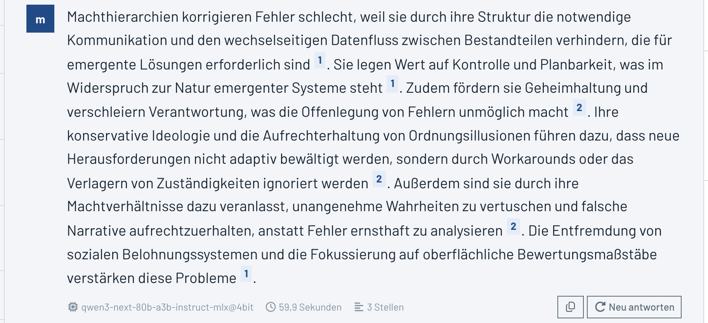
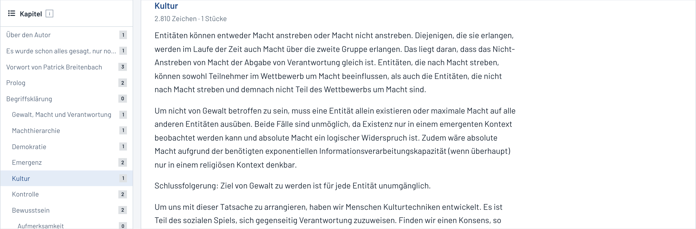
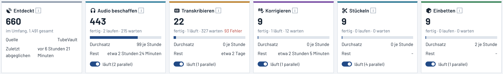
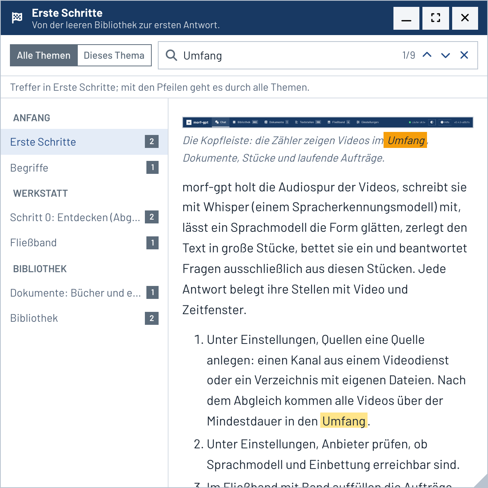
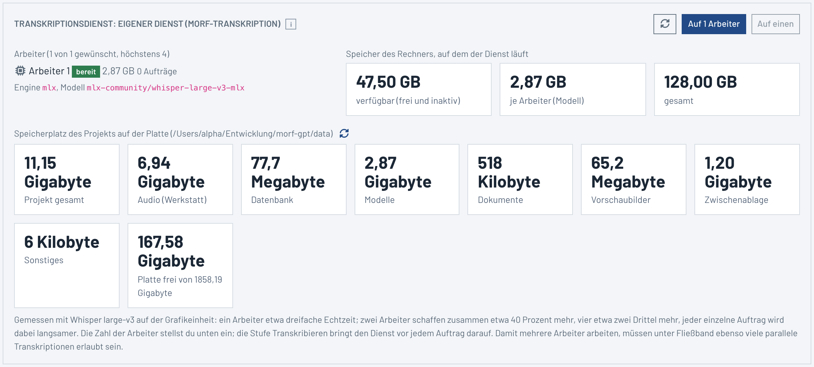

# morf-gpt

Wissensbibliothek und Chat über die Erklärvideos des Kanals morf und die Dokumente dazu.
Die Audiospuren der Videos werden bezogen, mit Whisper transkribiert, von einem Sprachmodell
behutsam in Form gebracht, in große Textstücke zerlegt, eingebettet und im Chat befragt;
E-Books und Texte gehen ohne Umweg über Kapitel in dieselbe Bibliothek. Jede Antwort
belegt ihre Aussagen mit Textstellen, die Video, Folge und Zeitfenster nennen und sich
sofort abspielen oder bei YouTube an derselben Sekunde öffnen lassen.

Die Architektur steht in [docs/ARCHITEKTUR.md](docs/ARCHITEKTUR.md).

## Was die Anwendung kann

<picture>
  <source media="(prefers-color-scheme: dark)" srcset="frontend/public/hilfe/chat-antwort-dunkel.png">
  
</picture>

*Eine Antwort im Chat: jede Aussage trägt die Nummer ihrer Stelle, ein Klick springt zur Fundstelle.*

- **Chat** als Hauptwerkzeug: Frage stellen, belegte Antwort lesen, Belege anklicken.
  Vor der Antwort lässt sich die Suche steuern: **Breite** (Anzahl Treffer, Nachbarstücke,
  höchstens je Video) und **Genauigkeit** (Mindestähnlichkeit, Neu-Bewertung mit lokalem
  Cross-Encoder oder Sprachmodell). Mit der Lupe nur suchen, Stellen abwählen, dann
  antworten lassen. Alles in großer Schrift.
- **Quellen**: ein Kanal aus TubeVault oder ein Verzeichnis mit eigenen Video- und
  Audiodateien auf diesem Rechner, beides nebeneinander. Lokale Dateien bringen Titel,
  Datum und Dauer mit; ein Beiblatt `name.json` und ein Bild `name.jpg` daneben werden
  übernommen.
- **Bibliothek**: alle Videos der Quellen mit Originaldaten, Vorschaubild, Serie und Folge,
  Stufe auf dem Fließband, Auswahl im Umfang, Stapelaktionen, Zurücksetzen auf eine Stufe.
  Metadaten und Vorschaubild lassen sich von Hand pflegen; gepflegte Felder bleiben beim
  Abgleich stehen.
- **Video im Detail**: Transkript mit Zeitmarken, Korrektur im Vergleich (roh und
  korrigiert Block für Block, verworfene Blöcke mit Begründung und Übernahme), Themen mit
  Zeitfenstern, Stücke, Aufträge, eigene Notizen.
- **Dokumente**: E-Books (EPUB), Markdown und Text hochladen oder eigene Texte anlegen.
  Sie werden in Kapitel gelesen, je Kapitel gestückelt und eingebettet und stehen dem Chat
  neben den Videos zur Verfügung; ein Beleg springt ins Kapitel der Leseansicht. Im Chat
  lässt sich auf Videos, Dokumente oder ein einzelnes Dokument einschränken.
  <picture>
  <source media="(prefers-color-scheme: dark)" srcset="frontend/public/hilfe/dokument-kapitel-dunkel.png">
  
</picture>

  *Die Dokumentansicht: Kapitel mit der Zahl ihrer Stücke, daneben die Leseansicht.*

- **Textstellen**: alle Stücke durchblättern, suchen, Überlappungen sehen, bearbeiten,
  teilen, zusammenlegen, neu einbetten oder ein Video neu stückeln.
- **Fließband**: sechs Stufen mit Zählern, Durchsatz und Restzeit, Pause je Stufe,
  laufende und fehlgeschlagene Aufträge, Protokoll live. Jede Stufe hat einen Info-Knopf,
  der erklärt, was in dem Schritt passiert und warum er wichtig ist.
  <picture>
  <source media="(prefers-color-scheme: dark)" srcset="frontend/public/hilfe/fliessband-stufen-dunkel.png">
  
</picture>

  *Das Fließband: je Stufe Zähler, Durchsatz, Restzeit und der Schalter zum Anhalten; der Info-Knopf erklärt den Schritt.*

- **Audiospieler** als feste Leiste: Abspielen ab Zeitmarke, Sprünge, Tempo, Zeitleiste
  mit den Themen, YouTube an derselben Stelle.
- **Einstellungen**: jede Grenze mit Beschreibung, Bereich und Vorgabe; Anbieter für
  Sprachmodelle und Einbettungen mit Rollen; Quellen; Umzug der Bibliothek als Paket.
  Die Einbettung lässt sich auf mehrere Modellinstanzen in LM Studio verteilen (gemessen bis
  1,6-fach), mit Prüfung des freien Speichers vor jedem Laden.
- **Werkzeuge und fremde Dienste** als Zusatzoption: MCP-Server und beliebige HTTP-Dienste
  mit JSON-Antwort lassen sich als weitere Quellen im Chat zuschalten. Ohne angelegte
  Werkzeuge bleibt der Chat reine Bibliothek; nichts davon ist Voraussetzung oder von
  sich aus aktiv. Entweder wählt der Nutzer die Werkzeuge je Frage, oder das Modell
  entscheidet selbst per Werkzeugaufruf. Ergebnisse werden wie Videostellen belegt, jeder
  Aufruf ist mit Argumenten und Dauer einsehbar.
- **Hilfe** als freischwebendes Fenster: ziehen, Größe ändern, minimieren, maximieren, Lage
  wird gemerkt. Themen sind Markdown-Dateien; die Volltextsuche läuft über alle Themen oder
  nur im gezeigten, mit Trefferzähler und Sprung von Treffer zu Treffer. Mini-i-Knöpfe
  öffnen genau das passende Thema, auf Wunsch gleich beim gesuchten Begriff.

  <picture>
  <source media="(prefers-color-scheme: dark)" srcset="frontend/public/hilfe/hilfe-fenster-dunkel.png">
  
</picture>

  *Das Hilfefenster: Suche über alle Themen mit Trefferzähler, Themenliste mit Trefferzahl, Fundstellen im Text markiert. Das Thema Begriffe erklärt jedes Fachwort der Oberfläche ohne Vorwissen.*

## Werkstatt und Bibliothek

Die Werkstatt braucht eine Videoquelle (TubeVault-Kanal oder ein Verzeichnis mit eigenen
Dateien), den mitgelieferten Transkriptionsdienst (Whisper, siehe unten) und ein
Sprachmodell für die Korrektur. Die Bibliothek braucht nur die
Datenbank, ein Einbettungsmodell und ein Sprachmodell. Sind die Daten einmal aggregiert,
läuft die Bibliothek samt Chat auch an einem anderen Ort: Paket unter Einstellungen,
Umzug exportieren und dort importieren. Als Sprachmodell eignet sich dann auch ein
OpenAI-kompatibler Dienst, als Einbettung das lokale bge-m3 über fastembed.

## Voraussetzungen

- Docker (für die Datenbank PostgreSQL mit pgvector)
- Python 3.12 und `uv`
- Node 22 und npm
- ffmpeg und ffprobe
- LM Studio mit `qwen3-next-80b-a3b-instruct-mlx` und `text-embedding-bge-m3` (oder ein
  anderer Anbieter, in der Oberfläche einstellbar)
- für die Werkstatt: eine Videoquelle (TubeVault oder ein Verzeichnis mit eigenen
  Dateien); der Transkriptionsdienst ist Teil des Projekts (auf Apple Silicon über MLX,
  sonst über CTranslate2 auf dem Prozessor) und lädt sein Modell beim ersten Start

## Start

```bash
./start.sh start
```

Das Skript legt beim ersten Mal `.env` aus `.env.example` an, startet die Datenbank im
Container, richtet die Python-Umgebungen ein, bringt das Schema auf den neuesten Stand und
startet Transkriptionsdienst, Backend und Oberfläche. Adressen stehen danach in der
Konsole (Vorgabe: Oberfläche `http://127.0.0.1:5460`, Backend `http://127.0.0.1:8460`,
Doku `/docs`, Transkriptionsdienst `http://127.0.0.1:8463`).

Weitere Befehle: `./start.sh stop`, `restart`, `status`, `logs`, `migrate`, `db`,
`transkription`. Das Backend wendet ausstehende Migrationen bei jedem Start auch selbst an.

## Transkriptionsdienst

Die Transkription läuft über einen eigenen, mitgelieferten Dienst
(`hilfsdienste/transkription`), damit die Werkstatt an keinem fremden Programm hängt. Er
hat sein eigenes venv, nutzt auf Apple Silicon die Grafikeinheit (MLX) und sonst den
Prozessor (CTranslate2), lädt sein Whisper-Modell beim ersten Start in `data/modelle`
und antwortet auf Port 8463 (`MORF_TRANSKRIPTION_PORT`). Wer stattdessen einen anderen
Dienst nutzt, setzt `MORF_TRANSKRIPTION_AKTIV=false` und wählt ihn unter Einstellungen,
Transkription.

Der Dienst hält einen oder mehrere Arbeiter, je einer mit geladenem Modell (etwa 3,5 GB).
Die Zahl steht unter Einstellungen, Transkription; die Stufe Transkribieren bringt den
Dienst vor jedem Auftrag darauf und lädt nur nach, wenn der freie Speicher reicht. Gemessen
auf der Grafikeinheit: ein Arbeiter etwa dreifache Echtzeit, zwei Arbeiter zusammen etwa
40 Prozent mehr, vier etwa zwei Drittel mehr. Mehrere Arbeiter arbeiten nur, wenn unter
Fließband ebenso viele parallele Transkriptionen erlaubt sind.

<picture>
  <source media="(prefers-color-scheme: dark)" srcset="frontend/public/hilfe/transkription-dienst-dunkel.png">
  
</picture>

  *Einstellungen, Transkription: Arbeiter des Dienstes, ihr Zustand, der Arbeitsspeicher des Rechners und der Speicherplatz des Projekts auf der Platte.*

## Erste Schritte

1. Einstellungen, Quelle und Auswahl: die TubeVault-Adresse (Schnittstelle und
   Oberfläche) eintragen; sie gilt an genau dieser einen Stelle für alle TubeVault-Quellen,
   den Audiobezug und die Sprünge zur Videoseite. Dann unter Einstellungen, Quellen eine
   Quelle anlegen: einen Kanal (Kanalkennung, Kanal prüfen) oder ein Verzeichnis mit
   eigenen Dateien (Verzeichnis prüfen). Dann Jetzt abgleichen.
2. Einstellungen, Anbieter: Sprachmodell und Einbettung prüfen, Rollen zuweisen.
3. Fließband: Band auffüllen. Ab dann laufen die Stufen von selbst weiter; die
   Erklärserie kommt zuerst.
4. Chat: sobald die ersten Videos eingebettet sind, antwortet er aus ihnen.

## Betrieb an einem anderen Ort

```bash
docker compose --env-file .env -f docker/docker-compose.yml --profile app up -d --build
```

Startet Datenbank und die gebaute Anwendung (Backend samt Oberfläche) im Container.
Danach das Paket unter Einstellungen, Umzug importieren und Anbieter einrichten. Soll dort
auch transkribiert werden, bringt das Profil `werkstatt` den Transkriptionsdienst als
Container (Whisper auf dem Prozessor); seine Adresse ist dann unter Einstellungen,
Transkription einzutragen (`http://transkription:8463` aus dem App-Container heraus).

## Bildschirmfotos für Hilfe und README

Die Bilder unter `frontend/public/hilfe/` sind gezielte Ausschnitte aus der laufenden
Anwendung (ein Regler, eine Karte, eine Leiste), keine Vollbilder. Jedes Motiv gibt es mit
demselben Ausschnitt hell und dunkel (`name.png`, `name-dunkel.png`); die Hilfe zeigt die
Fassung des gewählten Themas, das README die des Betriebssystems, beide in
Bildschirmpixeln (1:1). Die Maße stehen in `frontend/src/lib/hilfe/bildmasse.json`. Sie
entstehen reproduzierbar mit Chrome headless und dem DevTools-Protokoll, ohne weitere Pakete:

```bash
node tools/bildschirmfotos.mjs
```

Die Anwendung muss dafür laufen. Mit `--nur name,name` lassen sich einzelne Motive
erneuern; die Motive stehen im Skript.

## Mockups

Die Oberfläche folgt den Mockups unter `mockups/` (gleiches Stylesheet wie die App).
Layoutänderungen werden zuerst dort gemacht, dann im Svelte-Code nachgezogen.

```bash
./mockups/start-mockups.sh
```

## Lizenz

MIT-Lizenz, siehe [LICENSE](LICENSE). Nutzung, Änderung und Weitergabe sind frei, auch
kommerziell, solange der Lizenzhinweis erhalten bleibt.

---

## Unterstützen

morf-gpt ist ein privates Hobby-Projekt. Kein Tracking, keine Werbung, keine Kompromisse.

Wenn dir das Projekt gefällt, kannst du die Weiterentwicklung unterstützen - oder direkt hier:

[](https://ko-fi.com/HalloWelt42)

**Crypto:**

| Coin | Adresse |
|------|---------|
| BTC | `bc1qnd599khdkv3v3npmj9ufxzf6h4fzanny2acwqr` |
| DOGE | `DL7tuiYCqm3xQjMDXChdxeQxqUGMACn1ZV` |
| ETH | `0x8A28fc47bFFFA03C8f685fa0836E2dBe1CA14F27` |

Copyright (c) 2025-2026 HalloWelt42
